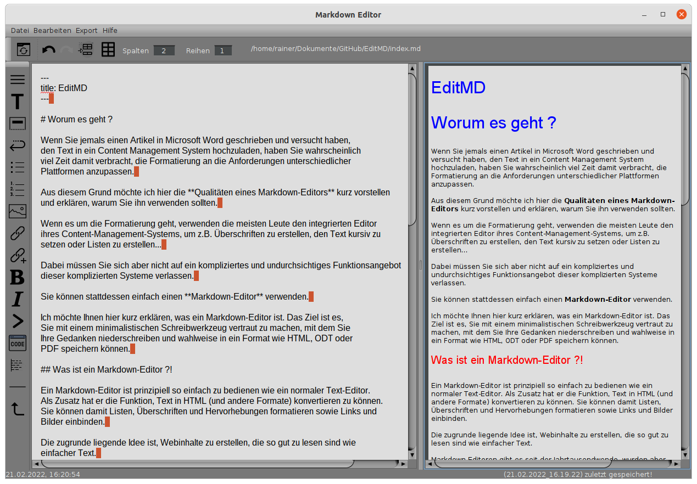

---
title: EditMD
---  

# Worum es geht ?

Wenn Sie jemals einen Artikel in Microsoft Word geschrieben und versucht haben,
den Text in ein Content Management System hochzuladen, haben Sie wahrscheinlich
viel Zeit damit verbracht, die Formatierung an die Anforderungen unterschiedlicher
Plattformen anzupassen.  

Aus diesem Grund möchte ich hier die **Qualitäten eines Markdown-Editors** kurz vorstellen
und erklären, warum Sie ihn verwenden sollten.  

Wenn es um die Formatierung geht, verwenden die meisten Leute den integrierten Editor
ihres Content-Management-Systems, um z.B. Überschriften zu erstellen, den Text kursiv zu
setzen oder Listen zu erstellen...  

Dabei müssen Sie sich aber nicht auf ein kompliziertes und undurchsichtiges Funktionsangebot
dieser komplizierten Systeme verlassen.  

Sie können stattdessen einfach einen **Markdown-Editor** verwenden.  

Ich möchte Ihnen hier kurz erklären, was ein Markdown-Editor ist. Das Ziel ist es, 
Sie mit einem minimalistischen Schreibwerkzeug vertraut zu machen, mit dem Sie 
Ihre Gedanken niederschreiben und wahlweise in ein Format wie HTML, ODT oder 
PDF speichern können.  

## Was ist ein Markdown-Editor ?!

Ein Markdown-Editor ist prinzipiell so einfach zu bedienen wie ein normaler Text-Editor.
Als Zusatz hat er die Funktion, Text in HTML (und andere Formate) konvertieren zu können.
Sie können damit Listen, Überschriften und Hervorhebungen formatieren sowie Links und 
Bilder einbinden.  

Die zugrunde liegende Idee ist, Webinhalte zu erstellen, die so gut zu lesen sind wie 
einfacher Text.  

Markdown-Editoren gibt es seit der Jahrtausendwende, wurden aber erst populär,
nachdem John Gruber von Daring Fireball, die Markdown-Syntax im Jahr 2004 eingeführt hatte.
Nachdem er frustriert war, mühsam HTML-Codes zum Formatieren seiner Texte schreiben zu müssen,
entwickelten er und sein Freund Aaron Swartz eine Klartext-Formatierungssyntax, mit der es möglich wurde,
Textinhalte schnell und einfach in HTML zu übersetzen.  

Das war die Geburtsstunde von Markdown.  

Die Sprache verwendet eine leicht zu erlernende Syntax, um das gleiche Ziel wie HTML zu erreichen.
Sie ist jedoch wesentlich einfacher zu erlernen als Hypertext-Markup.  
Mit Markdown codierter Text behält praktisch die gleiche Lesbarkeit wie uncodierter Text - ganz im
Gegenteil zur HTML-Codierung.  

Um einen Text webfähig zu machen, verwendet Markdown Zeichen und Symbole, mit denen Sie bereits 
vertraut sind. Die Anwendung ist leicht erlernbar und wird in den meisten Editoren durch 
Menü-Befehle unterstützt, die eigentlich die Funktion einer Gedächtnisstütze haben.  

Nach kurzer Einarbeitungszeit beherrschen Sie alle Markdown-Codes und können Ihre 
Texte flüssig mit der Tastatur erstellen und formatieren.  

## Vorteile der Verwendung von Markdown-Editoren

Abgesehen von der Beschleunigung des Formatierungsprozesses bieten Markdown-Editoren 
die folgenden Vorteile:  

1. Sie können in mehrere Formate exportieren.
	Markdown ist viel einfacher zu erstellen als HTML. Sie können den Inhalt in Formate wie
	HTML, ODT oder PDF exportieren.

1. Sie können auf jeder Plattform arbeiten.
	Markdown funktioniert auf allen Plattformen  wie z.B. Linux oder Windows.
1. Die Syntax ist kinderleicht zu erlernen.
1. Die Lesbarkeit des Textes verliert nur gering.

## EditMD

In der kostenlosen Software **EditMD** von Rainer Lüers sind alle oben genannten Features enthalten.
Das Programm überzeugt durch eine am täglichen Gebrauch orientierte Benutzeroberfläche.
Benutzerfreundlichkeit und intuitive Bedienung erleichtern es, in kürzester Zeit komplexe Seiten zu gestalten.  

## Systemvoraussetzungen

EditMD wurde in Java mit dem JDK 17.01 programmiert und kann in jeder Umgebung ausgeführt
werden, die ein Java Runtime Environment (JRE) der Version 17.01 oder höher bereitstellt.
EditMD wurde unter **Ubuntu 21.10** und **Windows 10** erfolgreich getestet.

## Download

Sie können EditMD **kostenlos** herunterladen und nutzen.  

<a href="EditMD_install.zip">EditMD downloaden</a>  

  
***EditMD*** Arbeitsbereich

EditMD is completely free to use for both individuals and businesses,
and includes no ads or unwanted software.  

complexity through simplicity ;-)

